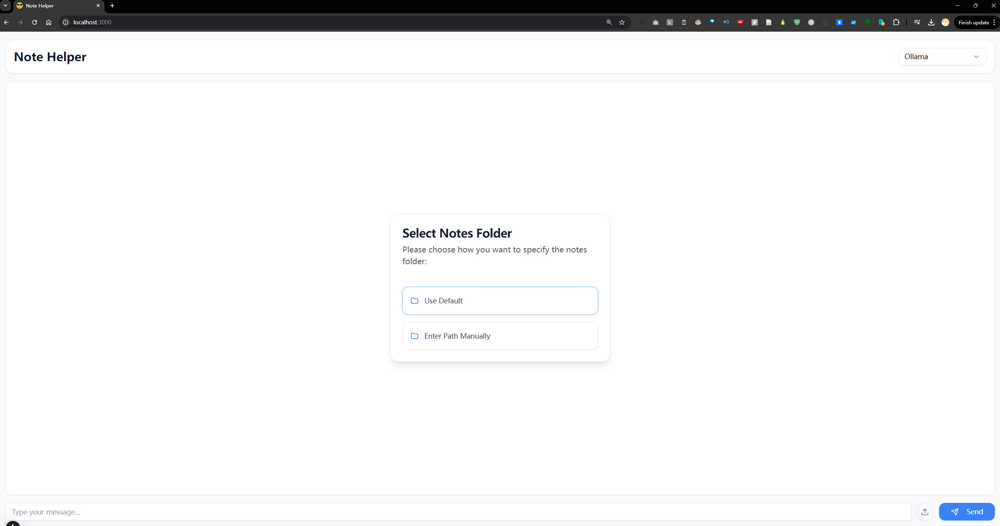

# ECE 570 Term Project

This project aims to reimplement the paper [“RAG: Retrieval-Augmented Generation for Knowledge-Intensive NLP Tasks”](https://proceedings.neurips.cc/paper/2020/hash/6b493230205f780e1bc26945df7481e5-Abstract.html). For model training, I explored three approaches:

- **Fine-tuning** both the retriever and generator using pre-trained models.
- **Training** both the retriever and generator from scratch.
- **Training** only the retriever component.

Due to limitations in GPU resources and time constraints, it proved impractical to train a fully functional model from scratch or to fine-tune both the retriever and generator concurrently. Consequently, I opted to utilize [LangChain](https://www.langchain.com/), a Python library tailored for constructing RAG systems, to develop the RAG application.

The resulting application, **Note Helper**, is a web-based tool that allows users to select a folder of documents as the knowledge base. Users can add more documents to the knowledge base at any time and ask questions about the content.

**Note Helper** is deployed locally, utilizing Ollama's open-source LLM models or OpenAI's models for versatile performance. It realized a context management system, which allows the model to have long-term memory. It features a user-friendly web application for seamless interaction and is complemented by a PyQt5 desktop application, providing users with flexible options for managing and querying their document-based knowledge base.

For a more comprehensive understanding of the project, please refer to the [Note Helper README](./note-helper-rag/README.md) located in the `note-helper-rag` directory and the [Training README](./train/README.md) found in the `train` directory.
